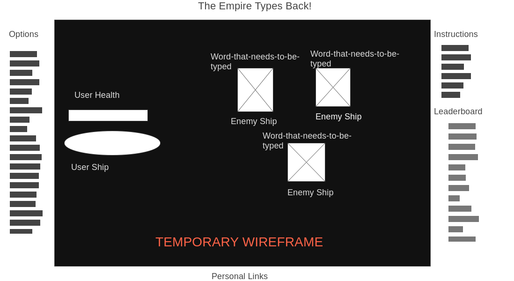

# The Empire Types Back!

## Background and Overview
Recently I became the proud new owner of a brand new mechanical keyboard. It is obviously much diferent from my last one, and I wanted a way to quickly adapt to it. So I figured, why not make a game out of it, and integrate my favorite franchise into it!
The Empire Types Back is an interactive game where the user pilots a starfighter and has to type to destroy enimy ships racing towards them. Upon completing the word on top of the enemy, that ship will be eliminated.

## Functionality and MVPs
- [ ] User will attack enemy ships by typing
- [ ] Enemy ships will spawn on the opposite end of the screen with words over them
- [ ] As more and more enemies are defeated, the words will get longer and the enemies will move faster
- [ ] The game will continue until the user is hit enough times by enemies that the user's health drains to 0

BONUS
- [ ] Add levels and bosses
- [ ] Add leaderboard
- [ ] Possibly add user movement for an additional level of interaction
- [ ] User health indicated by words, and enemies deal damage by 'typing'

## Wireframe

## Architecture and Technology

* Canvas will be used for the display
* Javascript will be used for the logic

### File Structure

* /dist 
  * …
* /src
  * …
* index.html
* .gitignore
* node_modules
* package.json
* package.lock.json
* postcss.config.js
* README.md
* webpack.common.js
* webpack.dev.js
* webpack.prod.js

* src
  * /assets
    sprites.png
    background
    music
  *index.js
  * /js
  * [...]
  * /scss
  * [...]
  
  ## Implementation Timeline
  
  Aug 17: Complete basic setup of project as well as a skeleton of the files. Conclude research if needed. Begin working on the game logic.
  
  Aug 18: Continue to work on the logic if necesarry. Then move onto the enemy movement and spawn rates. Hopefully end with a user model and words ontop of enemies.
  
  Aug 19: Implement the game logic to work with the animations and make the user model shoot at the enemy models. Hopefully finish the game and develop the finishing touched with design.
